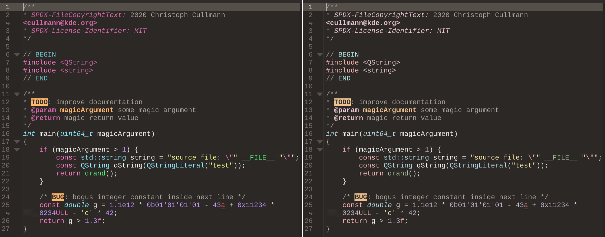

# Chocula Kate Themes
Dark brown themes with [Dracula palette](https://github.com/dracula) or pastel syntax highlighting for katepart applications ([Kate](https://kate-editor.org/), [KDevelop](https://kdevelop.org/), [Kile](https://kile.sourceforge.io/), and [KWrite](https://apps.kde.org/kwrite/))

## Installation
Download and extract the [zip file](https://github.com/SueDonham/chocula-kate-themes/archive/refs/heads/main.zip) or run `git clone https://github.com/SueDonham/chocula-kate-themes.git` in a terminal.

### Manual Installation
Import the .theme file(s) through any katepart program's settings menu (Configure > Color Themes > Theme Editor > Import), or copy to `~/.local/share/org.kde.syntax-highlighting/themes` and apply via each app's settings menu.
### Scripted Installation
Open a terminal window in the cloned or extracted directory and run: `./install.sh`

- [install.sh](./install.sh) imports the desired theme(s) and offers to set it as the default for any katepart apps installed.
- [remove.sh](./remove.sh) deletes the theme and updates config files to auto-select theme where Chocula was set as default.

## License
[GPLv3](./LICENSE)
